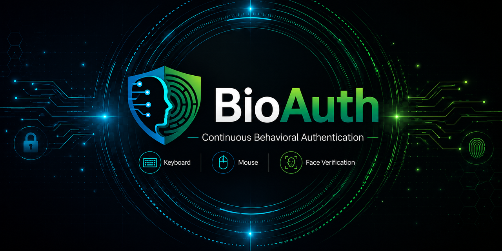
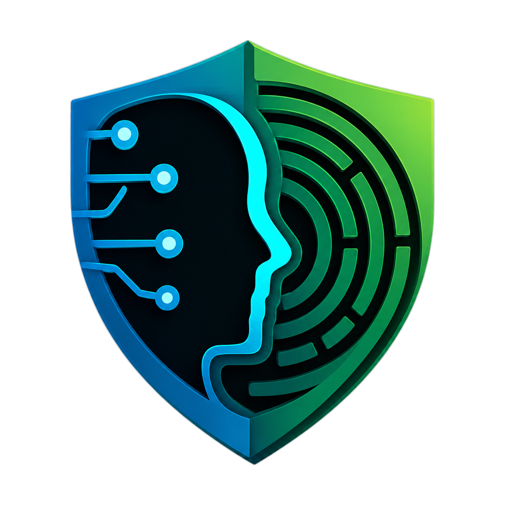

<div align="center">



</div>
<div align="center">



# BioAuth

### Continuous Behavioral Authentication for Windows

BioAuth is a Windows desktop security application that verifies the active user after login using behavioral biometrics, runtime risk analysis, and face verification.


</div>

---

## Overview

BioAuth protects an already logged-in Windows session by continuously checking whether the current user's behavior still matches the enrolled owner profile.

Instead of depending only on a password at login time, BioAuth monitors keyboard rhythm, mouse movement behavior, and identity confirmation signals during the active session.

When suspicious behavior is detected, the system can request face confirmation and lock the Windows session if the identity is not confirmed.

---

## Key Features

| Feature                    | Description                                          |
| -------------------------- | ---------------------------------------------------- |
| Continuous Authentication  | Verifies the active user during the session          |
| Keyboard Behavior Analysis | Learns and evaluates typing rhythm patterns          |
| Mouse Behavior Analysis    | Monitors movement and interaction behavior           |
| Runtime Risk Scoring       | Produces live risk decisions from user activity      |
| Face Verification          | Uses local ONNX-based face verification              |
| Windows Lock Integration   | Locks the session when identity is not confirmed     |
| Local-First Privacy        | Keeps behavioral and verification data on the device |

---

## System Workflow

1. User login
2. Behavioral profile training
3. Protection start
4. Keyboard and mouse monitoring
5. Runtime risk evaluation
6. Face confirmation on suspicious activity
7. Windows lock if identity is not verified

---

## Technology Stack

* Python 3.11
* PySide6 / QML
* OpenCV
* ONNX face models
* Machine learning-based behavioral analysis
* Windows local runtime integration

---

## Project Structure

```text
BioAuth/
├── desktop_app.py          # Main desktop entrypoint
├── logger.py               # Input logger worker
├── monitor.py              # Runtime monitor worker
├── bioauth_runtime/        # Runtime supervisor and workers
├── bridge/                 # Backend-to-QML bridge
├── model_runtime/          # Runtime model loading and decisions
├── training_core/          # Behavioral profile training
├── feature_extractors/     # Keyboard and mouse feature extraction
├── models/face/            # Required ONNX face models
├── qml/                    # User interface
└── src/bioauth/            # Package-style source modules
```

---

## Privacy Model

BioAuth is designed as a local-first security system.

Behavioral data, user profiles, runtime signals, and face verification data are intended to be processed and stored locally on the user's device. The system does not require cloud processing for its core protection flow.

---

## Status

BioAuth is under active development as a behavioral biometric authentication system for Windows desktop protection.

---

## License

This repository is currently published for project visibility and evaluation. Usage rights are defined by the included license or project owner permissions.

